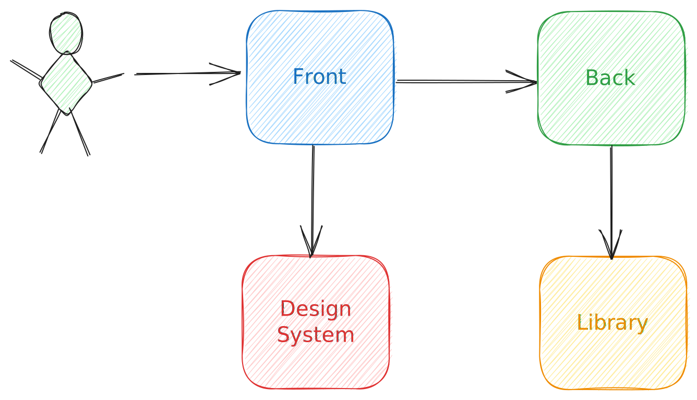

## Présentation NX

Note: authors : 
 - S. LAVAZAIS
 - J. SPICHT
 - A. QUERE

sources:

<!--v-->

## Plan de présentation

1. L'organisation du code au sein d'un repo
    - décrire l'organisation d'un repo type micro-service
    - décrire le cycle de dev typique
    - décrire les inconvénients
    - décrire un pseudo mono-repo avec le problème d'organisation que cela représente
2. Parler du cas idéal que serais un mono-repo
3. Présenter NX
    - décrire le principe du fonctionnement de NX
    - parler de la mise en pratique (quelques configs)
    - Demo !
4. Questions
5. Remerciements

Note:

<!--h-->

## L'organisation du code au sein d'un repo

 - décrire l'organisation d'un repo type micro-service
 - décrire le cycle de dev typique
 - décrire les inconvénients
 - décrire un pseudo mono-repo avec le problème d'organisation que cela représente

Note:

<!--v-->

<!-- .slide: data-auto-animate -->
### Un projet micro-service typique

Note :
Exemple en tête, un projet de micro-service typique, avec un back, un front, une librairie pour le back et 
un design system pour le front.
(on fait ici abstraction de la technologie employée)

<!--v-->

<!-- .slide: data-auto-animate -->
### Un projet micro-service typique

Présenter la manière dont est rangé le code
Présenter le cycle de dev de ce projet
Présenter ce qui se passe lors d'une release d'un composant.

Note:

<!--h-->

## Le cas idéal que serais un mono-repo

Note:

<!--h-->

## Présenter NX

 - décrire le principe du fonctionnement de NX
 - parler de la mise en pratique (quelques configs)
 - Demo !

Note:

<!--h-->

## Questions

Note:

<!--h-->

## Remerciements

Note:

