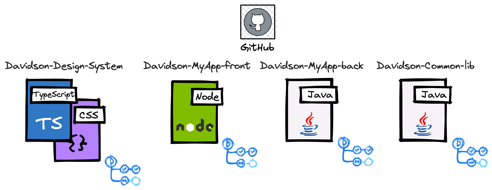
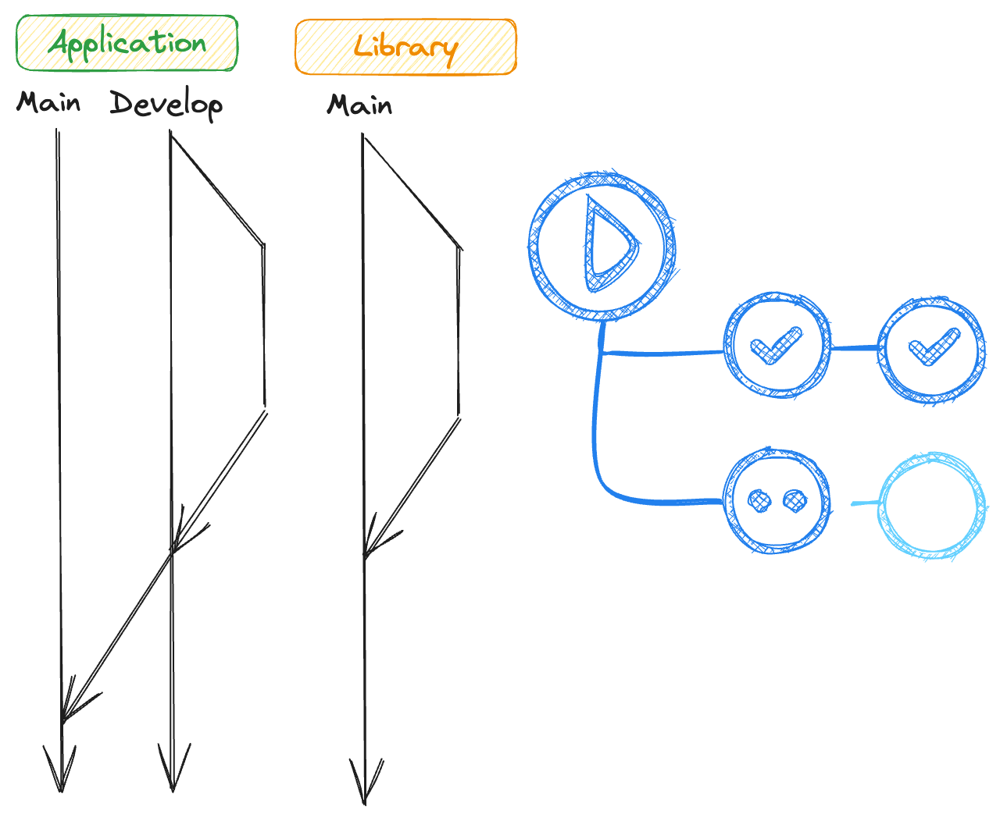
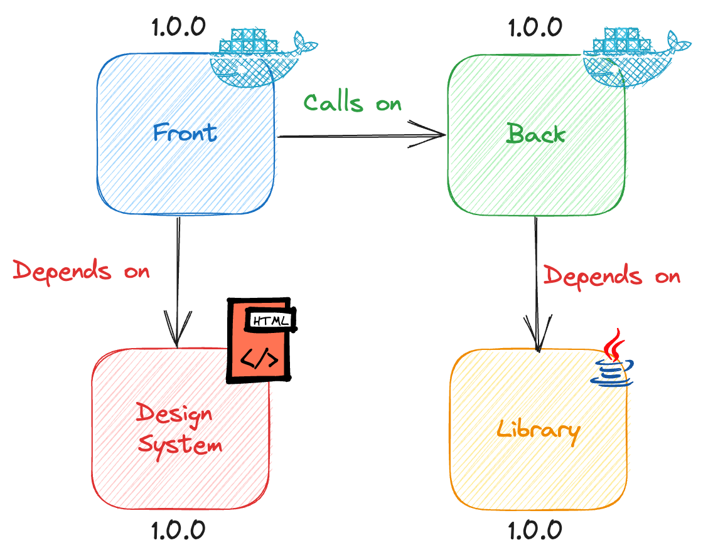
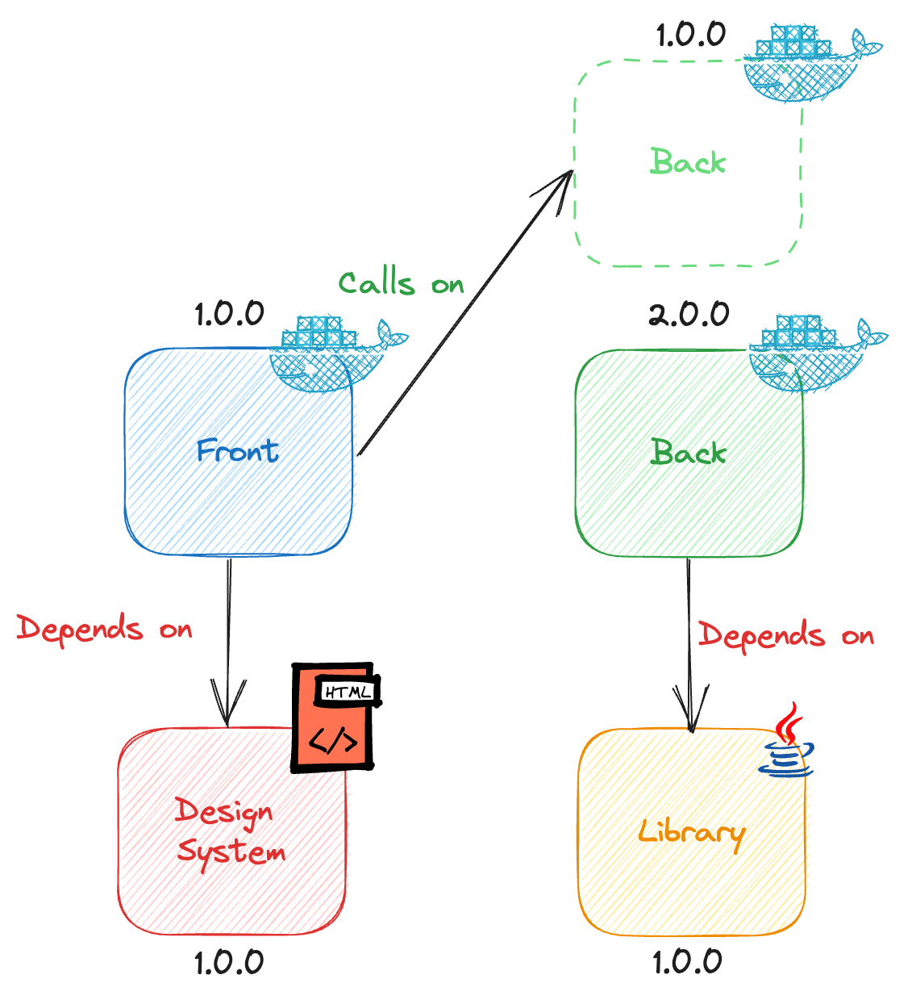
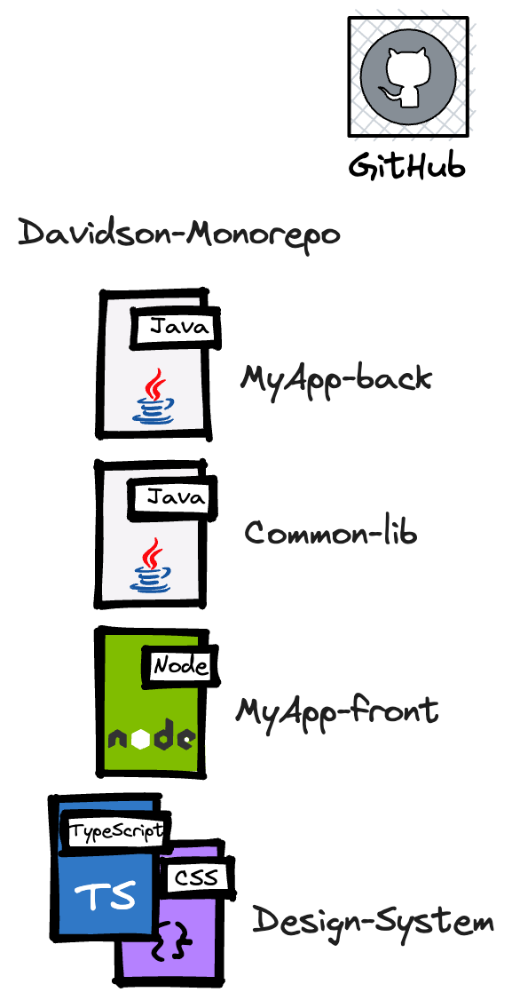
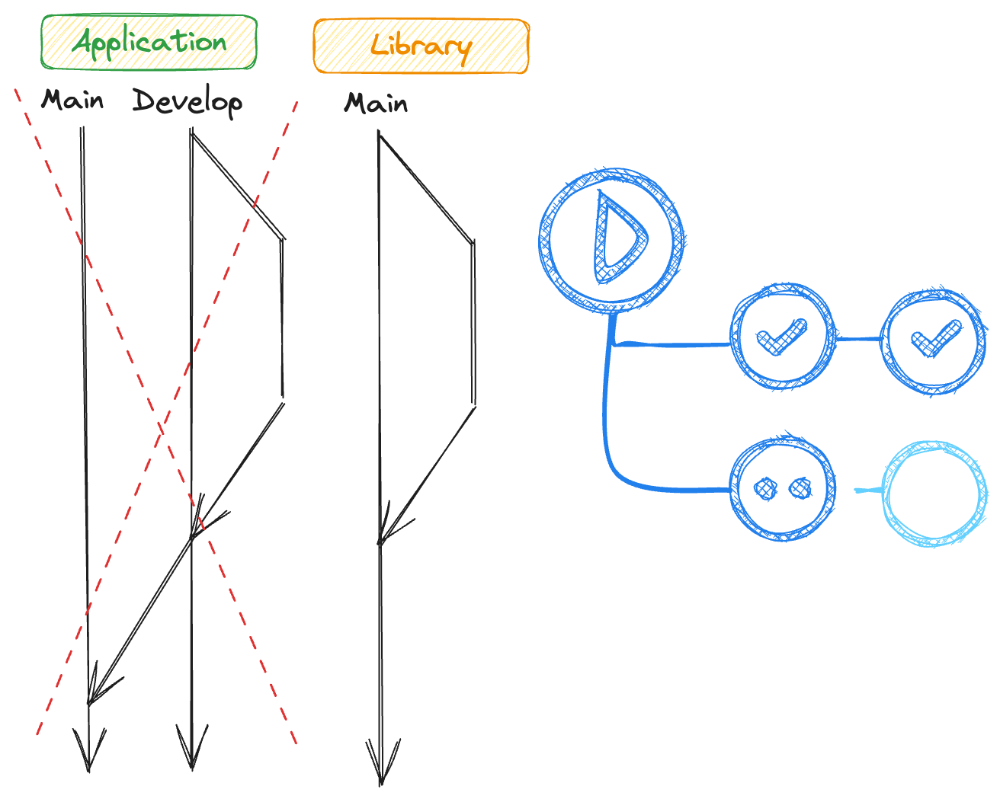
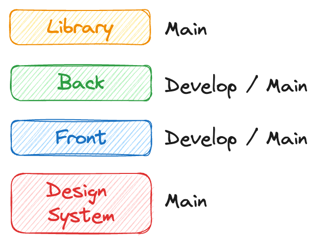
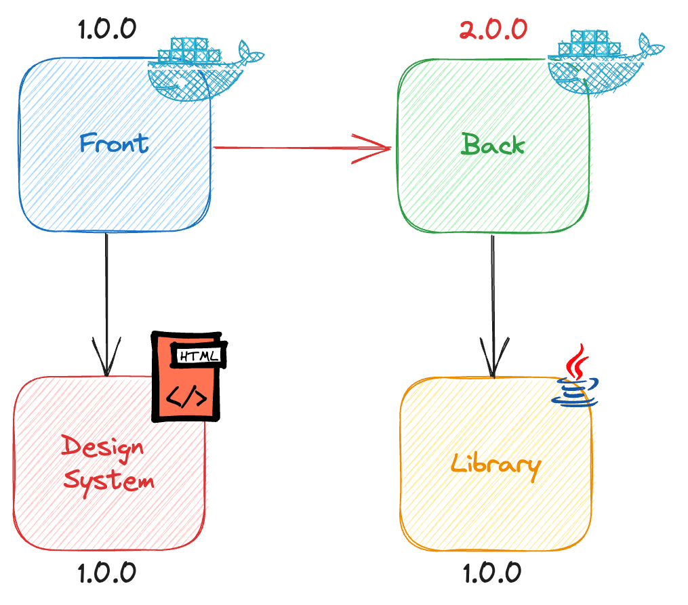

## Présentation NX
Par

Note: authors : 
 - S. LAVAZAIS
 - J. SPICHT
 - A. QUERE

sources:
 - https://excalidraw.com
 - https://nx.dev

<!--v-->

## Sommaire

1. Faire du micro-service avec plusieurs repository
2. Ça donnerait quoi dans un mono-repository ?
3. Et NX dans tout ça ?

Note:
le plan de la présentation

1. Faire du micro-service avec plusieurs repository
   - l'organisation multi-repo d'un projet micro-service
   - le cycle de dev typique
   - l'organisation des releases
2. Ça donnerait quoi dans un mono-repository ?
   - l'organisation du projet dans un mono-repository
   - l'adaptation du cycle de dev
   - l'adaptation des releases
3. Et NX dans tout ça ?
   - décrire le principe du fonctionnement de NX
   - parler de la mise en pratique (quelques configs)
   - Demo !
4. Questions
5. Remerciements

<!--h-->

<!-- .slide: data-auto-animate data-auto-animate-restart -->
#### Faire du micro-service avec plusieurs repository

Note:
Exemple en tête, un projet de micro-service typique, avec un back, un front, une librairie pour le back et 
un design system pour le front.
(on fait ici abstraction de la technologie employée)

<!--v-->

<!-- .slide: data-auto-animate -->
#### Faire du micro-service avec plusieurs repository
Les dépôts

Note:
le code est donc découpé en quatre repository (un pour chaque partie de ce micro-service).
Chaque dépôt GitHub possède son propre cycle de développement

<!--v-->

<!-- .slide: data-auto-animate -->
#### Faire du micro-service avec plusieurs repository
Les cycles de développements

Note:
Les cycles de développements varie ici en fonction de la nature du composant utilisé, on a donc du "trunk based" pour les 
composants type "librairie" (system design / lib back) et on est sûr du "git flow" pour nos composants 
type "application" (front / back)

<!--v-->

<!-- .slide: data-auto-animate -->
#### Faire du micro-service avec plusieurs repository
Les livraisons

Note:
Lors de la livraison d'un composant, on livre un composant sans pour autant être forcé de mettre à jour les composants
qui en depend

<!--v-->

<!-- .slide: data-auto-animate -->
#### Faire du micro-service avec plusieurs repository
Les livraisons

Note:
Si une dependence subit un changement bloquant, la version précédente est quant à elle toujours disponible, 
on n'est donc pas obligé de mettre à jour la version du composant qui depend de notre composant (pour l'instant)

<!--h-->

<!-- .slide: data-auto-animate data-auto-animate-restart -->
#### Ça donnerait quoi dans un mono-repository ?
Le dépôt

Note:
Si maintenant, on souhaite convertir ce projet en mode micro-service, quel serais le cas ideal pour gérer ce projet.
On s'attend donc à avoir un seul dépôt de code dans lequel on va retrouver la totalité de notre code

<!--v-->

<!-- .slide: data-auto-animate -->
#### Ça donnerait quoi dans un mono-repository ?
Les cycles de développements

Note:
si on regarde l'organisation de nos composants, rien n'as vraiment changer en termes de place dans leur fonction respective,
par-contre du point de vue de Git, on ne peut plus maintenir deux types de cycle de développement en parallèle.

<!--v-->

<!-- .slide: data-auto-animate -->
#### Ça donnerait quoi dans un mono-repository ?
Les cycles de développements

Note:
Comme nos composants n'existe pas dans toutes les versions et un à un instant T, des composants sont livré avec une/des 
version(s) qui ne corresponde(s) pas à leur besoin.

Il va falloir en choisir un, de telle façon que l'intégralité des composants existe toujours en toute version

<!--v-->

<!-- .slide: data-auto-animate -->
#### Ça donnerait quoi dans un mono-repository ?

Note:
du côté de la gestion des versions, là aussi, il faut adapter le mode de fonctionnement, car la suite complète 
des composants peut se retrouver dans une situation ou une livraison se retrouve dans un état d'incohérence

<!--v-->

<!-- .slide: data-auto-animate -->
#### Ça donnerait quoi dans un mono-repository ?

Note:
D'ordinaire, on devrait pouvoir gérer cette incohérence par une seconde livraison, ce qui peut rendre (dans notre cas) la
livraison "2" incohérente

<!--h-->

<!-- .slide: data-auto-animate data-auto-animate-restart -->
#### Et NX dans tout ça ?

Note:
NX est un framework comportant des outils et des techniques simples permettant d'accélérer grandement la productivité et 
la rendre plus 

<!--h-->

#### Merci pour votre temps !

Présenter par

   

       
      Anthony QUERE
   

   

       
      Jules SPICHT
   

   

       
      Sylvain LAVAZAIS
   

QRCode

Sources:
- https://excalidraw.com
- https://nx.dev

