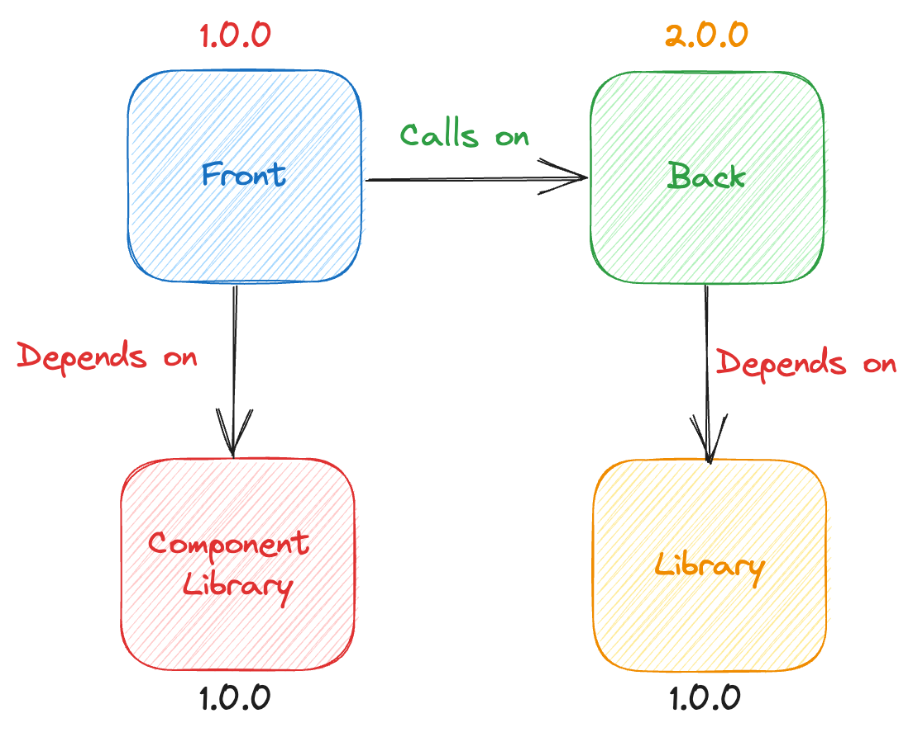

## Présentation NX
Par

Note: authors : 
 - S. LAVAZAIS
 - J. SPICHT
 - A. QUERE

sources:
 - https://excalidraw.com
 - https://nx.dev

<!--v-->

## Sommaire

1. Qu'est-ce qu'un mono-repository ?
2. Cas appliqué : un projet micro service
3. Et NX dans tout ça ?

Note:
le plan de la présentation

1. Qu'est-ce qu'un mono-repository ?
2. Cas appliqué : un projet micro service
   - présentation du cas
   - le cycle de dev 
     - en multi-repo
     - en mono-repo
   - l'organisation des releases
     - en multi-repo
     - en mono-repo
3. Et NX dans tout ça ?
   - décrire le principe du fonctionnement de NX
   - parler de ce qui a été réaliser sur le projet `DavLab`
   - Demo !
4. Questions
5. Remerciements

<!--h-->

<!-- .slide: data-auto-animate data-auto-animate-restart -->
#### Qu'est-ce qu'un "Mono-Repository" ?
Le principe de base

Note:
Lorsque l'on gère le code d'un projet type "micro-service", on range le code assez rapidement le code dans plusieurs
dépôts de code.

Le principe de base d'un mono-repository est de disposer tous ces dépôts dans un seul dépôt de code afin de garder 
de code dans une seule et même arborescence

<!--h-->

<!-- .slide: data-auto-animate data-auto-animate-restart -->
#### Cas appliqué : un projet micro service

Note:
Exemple en tête, un projet de micro-service typique, avec un back, un front, une librairie pour le back et 
un design system pour le front.

Maintenant, on va voir la différence concrète entre une organisation de code "classique" et une organisation en mode 
"mono-repository"

<!--v-->

<!-- .slide: data-auto-animate -->
#### Cas appliqué : un projet micro service
Le Cycle de développement

Note:
Comme on a pu le voir précédemment, le code est donc découpé en quatres dépôts (un pour chaque partie 
de ce micro-service).

Et Chacun de ces composants va avoir son propre cycle de développement

<!--v-->

<!-- .slide: data-auto-animate -->
#### Cas appliqué : un projet micro service
Le Cycle de développement

Note:
Dans le cas d'un mono repository, on ne peut pas avoir deux cycles de développements different.

Il faut donc en choisir un et faire en sorte que chaque composant s'inscrive dans ce nouveau cycle de développement.

Par soucis de simplicité, on peut choisir le trunk base, mais sur le papier, le git flow fonctionne également.

<!--v-->

<!-- .slide: data-auto-animate -->
#### Cas appliqué : un projet micro service
l'organisation des releases

Note:
Sur la partie livraison de composants, chacun des dépôts livre sa propre version.

<!--v-->

<!-- .slide: data-auto-animate -->
#### Cas appliqué : un projet micro service
l'organisation des releases

Note:
Par conséquence, lorsqu'un composant crée une dépendance vis à vis d'un autre, alors, on se retrouve à devoir mettre à
jour les liens de la dépendance en plusieurs fois.

<!--v-->

<!-- .slide: data-auto-animate -->
#### Cas appliqué : un projet micro service
l'organisation des releases

Note:
ce qui oblige donc à maintenir pendant une période de temps plusieurs versions de composants

<!--v-->

<!-- .slide: data-auto-animate -->
#### Cas appliqué : un projet micro service
l'organisation des releases

Note:
Il n'y a par ailleurs aucune vérification possible que cette dépendance est un impact sur les composants déjà livrés.

<!--v-->

<!-- .slide: data-auto-animate -->
#### Cas appliqué : un projet micro service
l'organisation des releases

Note:
Dans une mono-repository toute cette méchanique est beaucoup plus simple, car la cohérence entre les composants est 
systématiquement vérifiable à chaque tentative de livraison.

<!--v-->

<!-- .slide: data-auto-animate -->
#### Cas appliqué : un projet micro service
l'organisation des releases

Note:
Dans une mono-repository toute cette mécanique est beaucoup plus simple, car la cohérence entre les composants est
systématiquement vérifiable à chaque tentative de livraison.

<!--h-->

<!--v-->

<!-- .slide: data-auto-animate -->
#### Ça donnerait quoi dans un mono-repository ?
Les livraisons

Note:
D'ordinaire, on devrait pouvoir gérer cette incohérence par une seconde livraison, ce qui peut rendre (dans notre cas) la
livraison "2" incohérente

[//]: # (TODO: simplifier le schema d'explication du fait du breaking changes)

<!--h-->

<!-- .slide: data-auto-animate data-auto-animate-restart -->
#### Et NX dans tout ça ?

Note:
NX est un framework comportant des outils et des techniques simples permettant d'accélérer grandement la productivité et 
la rendre plus simple du point de vue de l'expérience développeur.

Dans notre cas de projet micro-service NX est l'outil idéal pour mettre en pratique un mono-repository presque parfait

<!--v-->

<!-- .slide: data-auto-animate -->
#### Et NX dans tout ça ?
Les dépôts

Note:

<!--h-->

#### Merci pour votre temps !

Présenter par

   

       
      Anthony QUERE
   

   

       
      Jules SPICHT
   

   

       
      Sylvain LAVAZAIS
   

QRCode

Sources:
- https://excalidraw.com
- https://nx.dev

